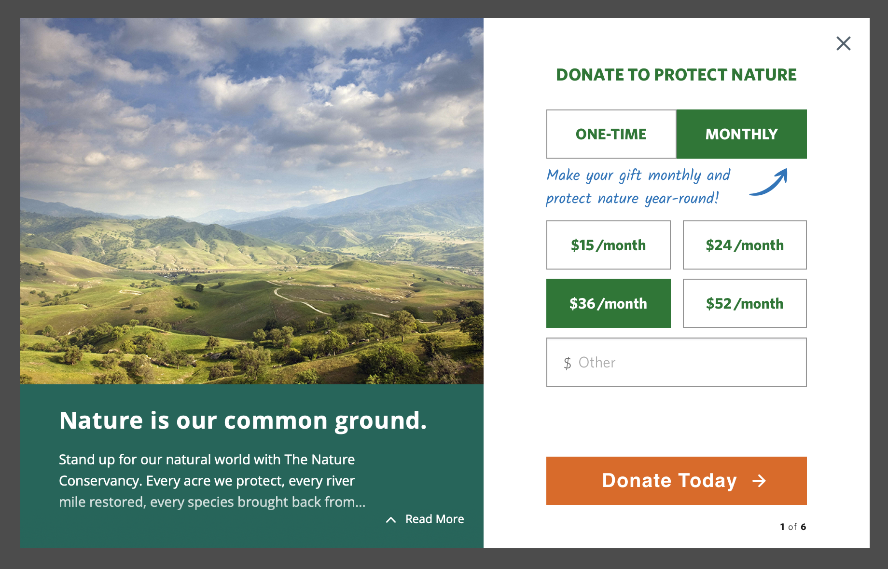

# TNC ENgrid Multistep Lightbox

This project makes it easy to create links to your Engaging Networks Donation Page as a lightbox with multiple steps.

## How to use

1. Add the script below to the page:

```html
<script
  defer="defer"
  src="https://aaf1a18515da0e792f78-c27fdabe952dfc357fe25ebf5c8897ee.ssl.cf5.rackcdn.com/2246/donation-lightbox-parent.js"
></script>
```

2. The script will look for the `data-donation-lightbox` attribute on every `a` tag and make it open as a lightbox, with the options below.

## Options

Every option can be set as a data attribute on the `a` tag, or as a JavaScript object.



**Options:**

- **name** - Name of the lightbox instance (for analytics/events). Default: "TNC Multi-Step Lightbox"
- **image** - Main image of the lightbox (used as a poster if video is set).
- **video** - Main video of the lightbox. If set, the image is used as a poster.
- **autoplay** - If true, the video will autoplay, be muted, and loop.
- **logo** - Logo image used in the lightbox. On mobile, it is scaled down and moved to the top.
- **divider** - Divider image used between the hero image/video and content.
- **title** - Title of the lightbox.
- **paragraph** - Main content of the lightbox.
- **mobile_enabled** - If false, disables the lightbox on mobile devices. Default: true.
- **mobile_title** - Title to display on mobile view.
- **mobile_paragraph** - Paragraph/content to display on mobile view.
- **footer** - Content of the footer area.
- **bg_color** - HEX color for the left column background. Default: #00675a
- **txt_color** - HEX color for the left column text. Default: #FFFFFF
- **form_color** - HEX color for the form theme. Default: #E5621A
- **url** - URL of the donation page. If set, the lightbox can auto-open on page load.
- **closeURL** - URL to redirect to when the lightbox is closed (optional).
- **cookie_hours** - Number of hours to not auto-open the lightbox after the user closes it. Default: 24
- **id** - Custom ID for the lightbox instance (for analytics/events).

Because the page can have multiple lightbox links, you can share options between them by creating a `DonationLightboxOptions` object. Example:

```javascript
DonationLightboxOptions = {
  logo: "https://............",
  footer: "This is my Footer text.",
};
```

On the example above, the logo and footer will be used for all links.

**Example of Link Without Lightbox:**

```html
<a href="https://preserve.nature.org/page/169438/1">Give Now</a>
```

**Example of Link With Lightbox:**

```html
<a
  href="https://preserve.nature.org/page/169438/1"
  data-donation-lightbox
  data-title="My Title Test"
  data-paragraph="My paragraph test"
  >Give Now
</a>
```

## Default Options Object

```javascript
DonationLightboxOptions = {
  name: "TNC Multi-Step Lightbox",
  image: "",
  video: "",
  logo: "",
  title: "",
  paragraph: "",
  mobile_enabled: true,
  mobile_title: "",
  mobile_paragraph: "",
  footer: "",
  bg_color: "#00675a",
  txt_color: "#FFFFFF",
  form_color: "#E5621A",
  url: null,
  closeURL: null,
  cookie_hours: 24,
  id: "",
};
```

### IMPORTANT: This project only works with the Engaging Networks Pages using the [engrid theme](https://github.com/4site-interactive-studios/engrid) or a client fork of ENgrid.

## Testing Notes

- The embedded EN Multistep Page URL must go directly to the page (HTTP status 200), and not be a redirect (HTTP status 301 or 302). If the page is a redirect, the lightbox will not work.

- If the lightbox is used on a staging website with a different top level domain than the embedded pages top level domain, Safari will experience issues due to security restrictions. To test on a staging domain with a different top level domain, you should use Chrome.

## Development

Your js code must be on the `src/app` folder. Styling changes must be on `src/scss`.

## Install Dependencies

1. `npm install`

## Deploy

1. `npm run build` - Builds the project
2. `npm run watch` - Watch for changes and rebuilds the project

It's going to create a `dist` folder, where you can get the `donation-lightbox-parent.js` file and publish it.

Currently it's published on:  
https://aaf1a18515da0e792f78-c27fdabe952dfc357fe25ebf5c8897ee.ssl.cf5.rackcdn.com/2246/donation-lightbox-parent.js
